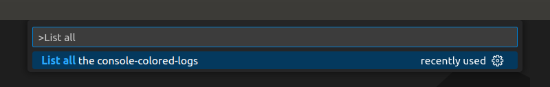
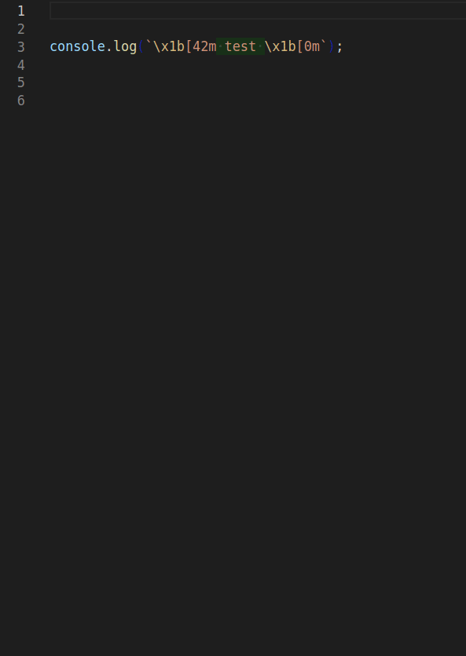

# Console Colored Logs Snippets

Very minimal set of snippets to add colors to `console.log`s (in javascript/typescript).

## How to use the snippets

After installing the extension the snippets will be immediately available in javascript and typescript files, just start typing `ccl-` to see all the available options (and `tab` to select one).

There are three type of snippets:

| snippet     | result                                                                 |
|-------------|------------------------------------------------------------------------|
|`ccl-X`      | a console log with its text colored `X`                                |
|`ccl-bg-Y`   | a console log with its background colored `Y`                          |
|`ccl-X-bg-Y` | a console log with its text colored `X` and its background colored `Y` |

Where `X` and `Y` indicate one of the following colors:
- `black`
- `red`
- `green`
- `yellow`
- `blue`
- `magenta`
- `cyan`
- `white`

### JSON Stringify

Additionally to any of the snippets mentioned you can add `-j` to also conveniently add a `JSON.stringify` in the log message (this helps printing objects in node environments).

For example the `ccl-red-j` snippets produces the following code: ``console.log(`\x1b[31m ${JSON.stringify()} \x1b[0m\`);``

## Additional Features
The extension also provides additional functionalities which complement the snippets.

### Highlights

Highlights apply the colors to the generated console logs, this may be quite helpful if you're using different logs and want to have a clearer indication as to which log is generated by which line of code (without having to add some marker text inside the log's argument text).

To enable the highlights simply go to the extensions options and enable it from there.

### Listing all console logs

The `List all the console-colored-logs` command lists all the console colored logs present in the current workspace.

The command can be run from the [command palette](https://code.visualstudio.com/docs/getstarted/userinterface#_command-palette):

All the logs will be listed in a new "console colored logs listing" output channel.

### Change the colors of existing logs

If you've already added a log via the snippets you can easily tweak its colors by selecting the whole log command, clicking on the lightbulb icon and choosing the option you want:

## Extra Notes

- This set of snippets was created to provide a very minimal quick and dirty way to add colors to nodejs' `console.log` calls since for them you need to remember the color codes (as they don't accept css stylings as the browser's calls do). Anyways browsers also accept the color codes so the snippets can also be used in standard browser js as well.

- Source for the color codes: [abritinthebay/consoleColors.js](https://gist.github.com/abritinthebay/d80eb99b2726c83feb0d97eab95206c4).

- The purpose for these snippets is for quickly styling the `console.log`s when debugging to allow you to
easily identify the outputs you're interested in. If you want to provide proper styling for your application I would suggest to use proper libraries instead, such as [chalk](https://github.com/chalk/chalk) or [cli-color](https://github.com/medikoo/cli-color) for nodejs apps.
